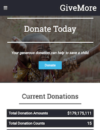
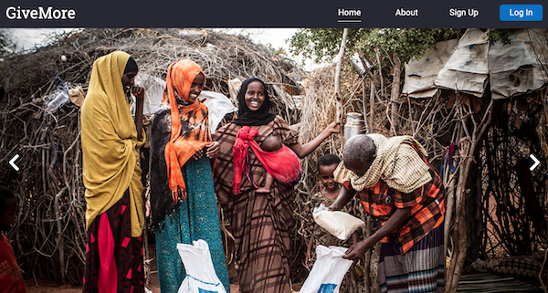

# GiveMore Donor Management Marketing Pages

 

###About
This is a responsive multi-page marketing web page for the *GiveMore* web application. The application is intended toward donation or fundraising companies who want to keep track of their donors and donor amounts.

The marketing pages built from many reusable Javascript components where each component is consisted of HTML, Less, and vanilla Javascript.  No Javascript frameworks and UI libraries were used in the contruction of the web pages.

###Installation
The entire web pages source files are in the *.src* directory.  The files are separated by *assets*, *components*, *styles* folders. The Javascript and HTML of each page are stored in the root directory. Below is an explanation of each page:

1.index.html: **this is the home page to display a call-to-action about a donation cause and some introductions about the app.**

2.about.html: **this page displays our developer team where a user can click on an avatar of a team member to display his/her brief biography.**

3.error.html: **this page will not display unless a user navigates to a page that does not exist on the server. This is a 404 error.**

The *.dist* contained the compacted form of the entire marketing pages. Each Javascript file is minified to reduce its size.

###Deployment
The production version of the web page is deployed on Amazon AWS [here](http://tqn-buildweekone.s3-website-us-west-2.amazonaws.com/index.html)

###Local Environment
I recommend to have *[npm](https://www.npmjs.com/)* or *[yarn](https://yarnpkg.com/en/)* setup and *[webpack](https://webpack.js.org/)* setup for the project.  For live testing on a browser, I used *[webpack-dev-server](https://github.com/webpack/webpack-dev-server)* to auto compile the project. For complete listing of all the packages, please review *package.json* file.

